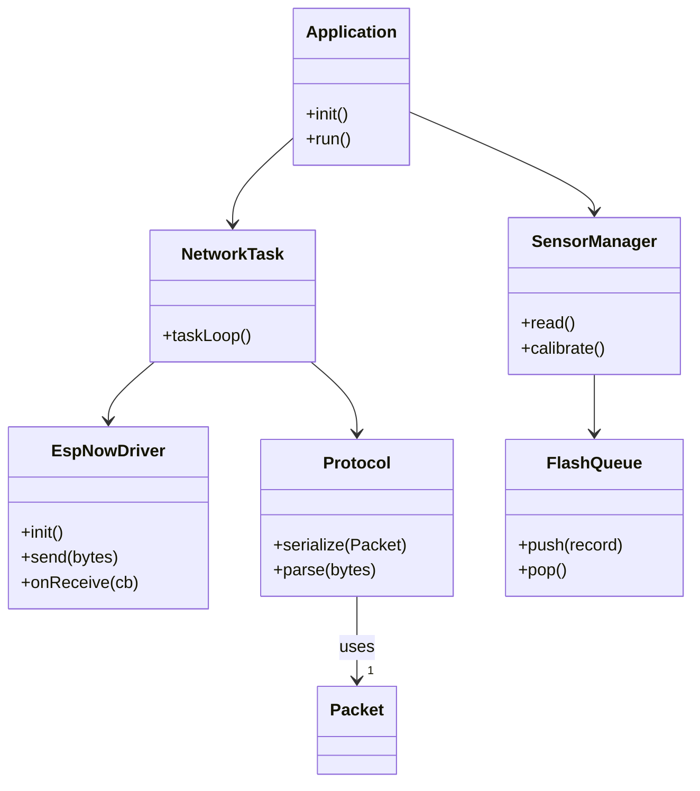
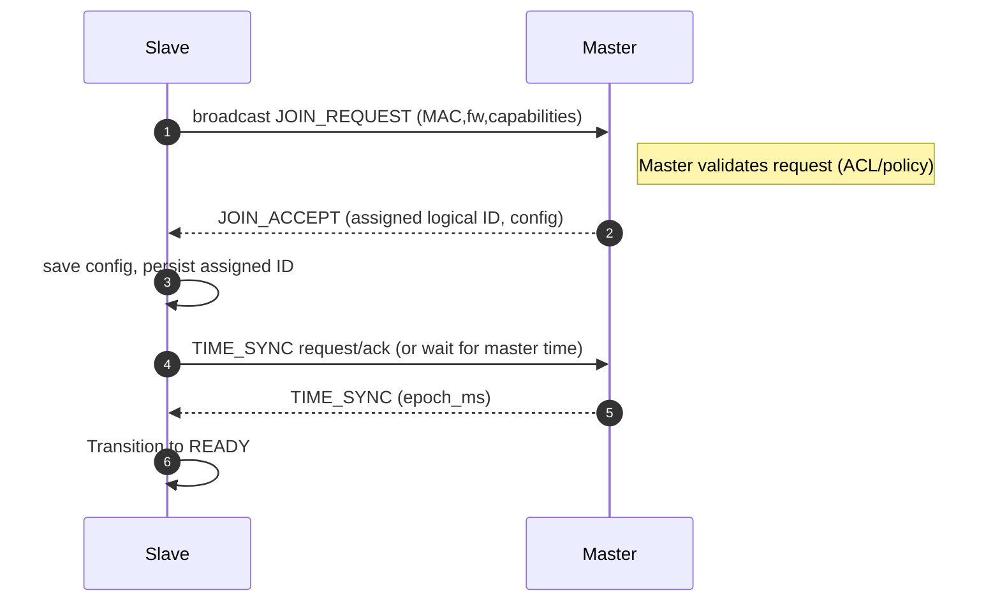
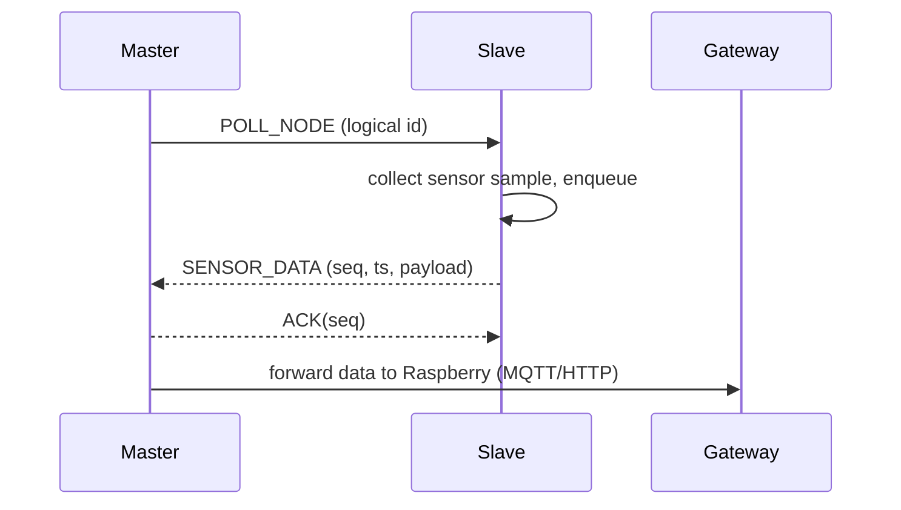

# SmartScale-ESP32 — Architecture Overview

This document contains high-level class and sequence diagrams for the restructured firmware (Master/Slave, ESP-NOW), intended as the first deliverable for the migration.

## Goals
- Show core components and responsibilities
- Provide sequence diagrams for discovery and polling flows
- Keep diagrams compact and implementation-oriented

## Core components (conceptual)
- Application (bootstrap)
- Core/Scheduler/ConfigManager/Logger
- Network: EspNowDriver, Protocol, Discovery, Polling, TimeSync, Routing
- Storage: Preferences, FlashQueue (persistent circular buffer)
- Sensors: HX711Driver, SensorManager
- Tasks: NetworkTask, SensorTask, StorageTask, HeartbeatTask, OTATask
- Models: Node, Packet, NetworkTable

## Mermaid: Component Class Diagram

## Sequence: Discovery / Join

## Sequence: Polling / Data Flow

## Notes
- Each state implements onEnter/update/onExit (State pattern).
- Tasks communicate via RT-safe queues.
- Use persistent FlashQueue for offline resilience.
